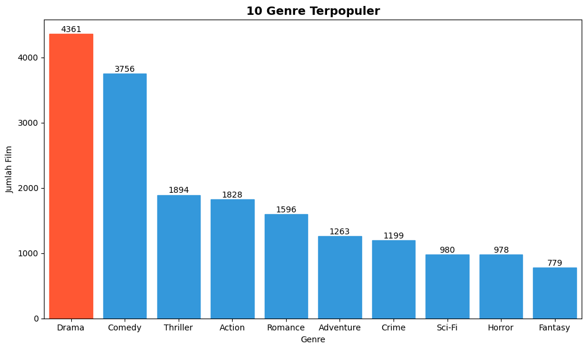
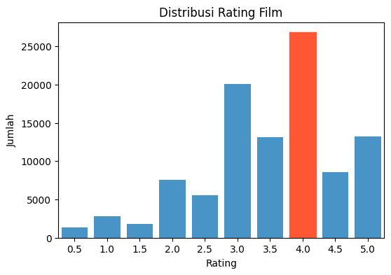
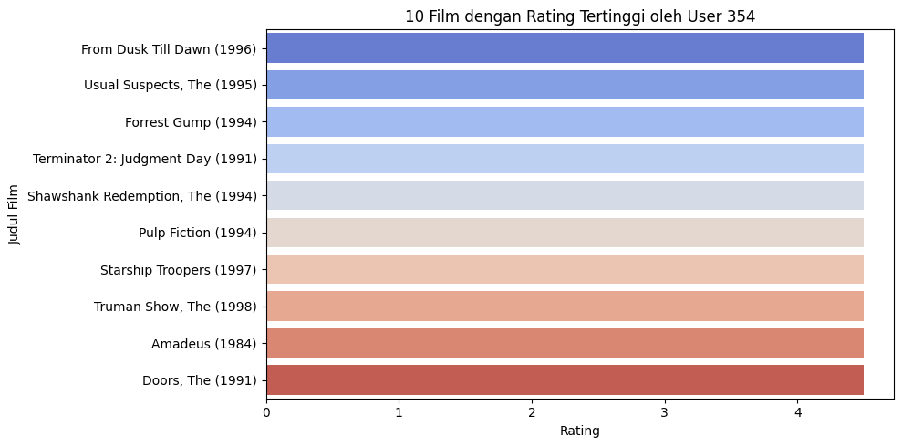
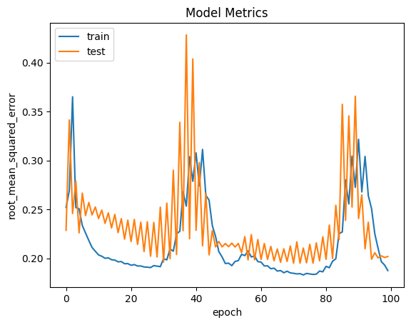

# Laporan Proyek Machine Learning - Fatmah Fianka Syafrudin

## Project Overview

Seiring perkembangan layanan streaming digital seperti Netflix dan Disney+, pengguna dihadapkan pada information overload akibat banyaknya pilihan film. Terdapat 49% pengguna merasa kesulitan memilih tontonan karena terlalu banyak opsi [[1](https://www2.deloitte.com/us/en/insights/industry/technology/digital-media-trends-consumption-habits-survey/2025.html)]. Oleh karena itu, sistem rekomendasi menjadi solusi penting untuk membantu pengguna menemukan film sesuai preferensi mereka.

Sistem rekomendasi berbasis machine learning mampu mempelajari pola pengguna secara dinamis dan memberikan rekomendasi yang relevan. Pendekatan seperti Collaborative Filtering, Content-Based Filtering, hingga hybrid dan deep learning terbukti efektif dalam meningkatkan kualitas personalisasi [[2](https://link.springer.com/article/10.1007/s00799-015-0156-0)].

Proyek ini bertujuan untuk membangun sistem rekomendasi film berbasis Content-Based Filtering yang mampu memberikan saran tontonan secara personal kepada pengguna. Sistem ini akan menganalisis karakteristik konten film, seperti genre dan kata kunci, serta preferensi pengguna dari data historis rating, untuk menentukan film yang relevan.

## Business Understanding

### Problem Statements

- Pengguna kesulitan menemukan film yang sesuai dengan preferensi pribadi mereka karena terlalu banyak pilihan film yang tersedia di platform digital. Hal ini menyebabkan pengalaman pengguna menjadi kurang optimal dan dapat mengurangi minat menonton.

- Sistem rekomendasi konvensional sering kali belum memanfaatkan data historis pengguna secara optimal, sehingga belum mampu menyajikan rekomendasi yang benar-benar relevan dan personal.

- Kurangnya sistem rekomendasi yang secara efektif menggabungkan pendekatan berbasis konten (seperti genre film) dan kolaboratif (berdasarkan kesamaan preferensi antar pengguna), sehingga potensi data pengguna belum dimanfaatkan sepenuhnya untuk meningkatkan akurasi rekomendasi.

### Goals

- Meningkatkan pengalaman pengguna dalam memilih film dengan menghadirkan rekomendasi yang relevan berdasarkan preferensi pribadi pengguna, tanpa harus menelusuri ribuan pilihan secara manual.
- Membangun sistem rekomendasi film dengan dua pendekatan utama Content-Based Filtering dan Collaborative Filtering yang memanfaatkan data historis pengguna seperti rating dan genre film.
- Mengembangkan model yang mampu mengidentifikasi kemiripan antar film maupun pola preferensi antar pengguna, guna menyarankan film yang sesuai dengan minat pengguna.

### Solution Approach

- Content-Based Filtering menggunakan Cosine Similarity
  Sistem akan menghitung kemiripan antar film berdasarkan fitur seperti genre dan menggunakan representasi TF-IDF. Cosine Similarity akan digunakan untuk mengukur kedekatan antar film dan menghasilkan rekomendasi yang sesuai dengan film yang disukai pengguna sebelumnya.

- Implementasi dan evaluasi model dengan metrik seperti Precision@K
  Untuk menilai efektivitas rekomendasi, metrik Precision@K digunakan guna mengukur proporsi rekomendasi yang relevan di antara K rekomendasi teratas yang diberikan kepada pengguna.

## Data Understanding

Dataset yang digunakan dalam proyek ini berasal dari [Movies & Ratings for Recommendation System](https://www.kaggle.com/datasets/nicoletacilibiu/movies-and-ratings-for-recommendation-system) yang tersedia di platform Kaggle. Terdapat 2 datase yaitu movies yang memiliki 9742 baris dan 3 kolom dan ratings yang memiliki 100836 baris dan 4 kolom. Tidak terdapat duplikasi data dan missing values pada kedua dataset yaitu movies maupun ratings. Dataset ini berisi data tentang film, genre, dan penilaian pengguna, yang dapat digunakan untuk membangun sistem rekomendasi berbasis konten.

### Variabel-variabel pada dataset adalah sebagai berikut:

Pada proyek kali ini terdapat 2 dataset yaitu movies dan ratings.  
Variabel-variabel pada kedua dataset adalah sebagai berikut:

- movies : berisi informasi film.

  - movieId: ID unik untuk setiap film
  - title: Judul film, biasanya mencakup nama film diikuti tahun rilis dalam tanda kurung.
  - genres: daftar genre film, bisa berisi satu atau beberapa genre yang relevan dengan film tersebut, jika terdapat lebih dari satu genre, mereka dipisahkan dengan tanda `|`.

- ratings : berisi data rating yang diberikan pengguna.
  - userId: ID unik untuk setiap pengguna yang memberikan rating.
  - movieId: ID film yang diberikan rating oleh pengguna.
  - rating: Nilai rating yang diberikan pengguna untuk film tersebut. Biasanya berupa skala penilaian 0.5 – 5.0 di mana nilai semakin tinggi angka berarti pengguna lebih menyukai film tersebut.
  - timestamp: timestamp yang menunjukkan kapan rating diberikan.

### Exploratory Data Analysis (EDA)

- Frekuensi Genre
    
  **Gambar 1**

  Dapat dilihat pada grafik Top 10 Genre Terpopuler menunjukkan bahwa genre terbanyak adalah Drama dengan total 4361 film, diikuti dengan Comedy, Thriller, Action, Romance, Adventure, Crime, Sci-Fi, Horror dan yang terakhir Fantasy.

- Distribusi Rating
  
  **Gambar 2**

  Dapat dilihat bahwa rating 4.0 adalah yang paling sering diberikan untuk film yang ditonton. Sementara rating rendah seperti 0.5, 1.0, dan 1.5 cenderung jarang diberikan oleh pengguna.

## Data Preparation

1. **Transformasi Kolom genres:**
   Pada dataset movies, setiap film memiliki daftar genre yang dituliskan dalam satu kolom sebagai string, di mana masing-masing genre dipisahkan oleh simbol pipe (|). Sebelum melakukan pemodelan Content Based, delimiter | ini diubah menjadi spasi. Contohnya, genre “Action|Adventure|Comedy” akan diubah menjadi “Action Adventure Comedy”. Perubahan ini bertujuan agar setiap genre dapat diperlakukan sebagai kata terpisah ketika teks genre tersebut diproses lebih lanjut.

2. **Tokenisasi Genre dengan TF-IDF:**  
   Kolom genres pada dataset movies berisi daftar genre dalam format teks, seperti "Action|Adventure|Sci-Fi". Untuk dapat digunakan dalam model, informasi ini dikonversi menjadi representasi numerik menggunakan TF-IDF Vectorizer. Dengan metode ini, setiap film akan memiliki vektor fitur berdasarkan bobot pentingnya masing-masing genre. Representasi numerik ini memungkinkan perhitungan kesamaan film dan bisa digunakan dalam berbagai model pembelajaran mesin.

3. **Penghapusan Kolom timestamp:**  
   Kolom timestamp dari dataset ratings dihapus karena tidak digunakan dalam proses analisis maupun model rekomendasi. Menghapus kolom yang tidak relevan membantu menyederhanakan dataset dan mempercepat proses pelatihan.

4. **Encoding userId dan movieId:**  
   Kolom userId dan movieId berisi ID asli yang tidak berurutan dan tidak langsung dapat digunakan oleh model. Oleh karena itu, dilakukan encoding ke bentuk integer yang berurutan agar dapat dimanfaatkan dalam layer embedding dan mempermudah proses pelatihan model.

5. **Konversi Rating ke Float:**  
   Kolom rating dikonversi ke tipe data float untuk memastikan kompatibilitas dengan framework machine learning seperti TensorFlow, yang lebih optimal menangani tipe data numerik desimal dalam proses komputasi.

6. **Pengacakan Urutan Data:**  
   Sebelum dilakukan pembagian data, urutan baris data diacak menggunakan fungsi `sample(frac=1, random_state=42)` untuk menghindari bias akibat urutan data tertentu, seperti berdasarkan waktu atau ID pengguna.

7. **Normalisasi Rating:**  
   Nilai rating yang semula berada pada rentang 0.5 hingga 5.0 dinormalisasi menjadi rentang 0 hingga 1 menggunakan metode min-max normalization. Langkah ini penting agar model dapat mempelajari pola preferensi pengguna dengan lebih efisien dan stabil.

8. **Split Data Training dan Validasi:**  
   Melakukan pembagian ke dalam data training dan validasi dengan proporsi 80:20. Data training digunakan untuk membangun model, sementara data validasi digunakan untuk mengukur performa model terhadap data yang belum pernah dilihat sebelumnya, sehingga dapat meminimalisasi overfitting.

## Modeling

Proyek ini membangun sistem rekomendasi dengan dua pendekatan utama: Content-Based Filtering dan Collaborative Filtering, masing-masing dengan mekanisme kerja dan keunggulan berbeda.

### Content-Based Filtering

Content-Based Filtering merekomendasikan film berdasarkan kemiripan kontennya, khususnya genre. Sistem menganalisis genre film yang disukai pengguna dan mencari film lain dengan genre serupa.

- Pendekatan Modeling: Genre film dikonversi menjadi vektor numerik menggunakan TF-IDF Vectorizer. Vektor tersebut mencerminkan bobot penting setiap genre pada sebuah film. Kemudian, dihitung cosine similarity antar film untuk mengetahui tingkat kemiripan berdasarkan genre.

- Membuat Rekomendasi: Sistem memilih film yang disukai pengguna sebagai referensi, lalu menampilkan Top-10 film paling mirip berdasarkan nilai Cosine Similarity.

  - Contoh Rekomendasi:  
    Sebagai ilustrasi, misalkan pengguna menyukai film "Pacific Rim (2013)".

    | movieId | title              | genres                       |
    | ------- | ------------------ | ---------------------------- |
    | 89745   | Pacific Rim (2013) | Action Adventure Sci-Fi IMAX |

    Berdasarkan analisis kemiripan genre (Action Adventure Sci-Fi IMAX) menggunakan TF-IDF dan Cosine Similarity, sistem merekomendasikan 10 film yang paling mirip dengan Pacific Rim (2013). Terdapat Top 10 film yang dihasilkan oleh model Content-Based Filtering untuk contoh film ini adalah:

    |     | title                                              | genres                       |
    | --- | -------------------------------------------------- | ---------------------------- |
    | 0   | Ender's Game (2013)                                | Action Adventure Sci-Fi IMAX |
    | 1   | Avengers, The (2012)                               | Action Adventure Sci-Fi IMAX |
    | 2   | Superman Returns (2006)                            | Action Adventure Sci-Fi IMAX |
    | 3   | Star Trek (2009)                                   | Action Adventure Sci-Fi IMAX |
    | 4   | Spider-Man 2 (2004)                                | Action Adventure Sci-Fi IMAX |
    | 5   | John Carter (2012)                                 | Action Adventure Sci-Fi IMAX |
    | 6   | Tron: Legacy (2010)                                | Action Adventure Sci-Fi IMAX |
    | 7   | Godzilla (2014)                                    | Action Adventure Sci-Fi IMAX |
    | 8   | Star Trek Into Darkness (2013)                     | Action Adventure Sci-Fi IMAX |
    | 9   | Star Wars: Episode II - Attack of the Clones (...) | Action Adventure Sci-Fi IMAX |

    Semua film di atas memiliki kesamaan genre yang kuat dengan Pacific Rim. Hal ini menunjukkan bahwa pendekatan content-based berhasil mengelompokkan film-film dengan karakteristik serupa. Jika pengguna menyukai Pacific Rim, besar kemungkinan ia juga akan tertarik dengan film-film serupa.

**Kelebihan Content-Based Filtering:**

- Pendekatan ini tidak bergantung pada data rating atau preferensi pengguna lain, sehingga sangat berguna untuk merekomendasikan film baru yang belum memiliki banyak feedback. Selama informasi konten seperti genre tersedia, film tersebut bisa direkomendasikan, sehingga membantu mengatasi masalah cold-start untuk item baru.

- Rekomendasi yang diberikan mudah untuk dijelaskan kepada pengguna, misalnya “Film ini direkomendasikan karena genre-nya mirip dengan film favorit Anda,” sehingga meningkatkan transparansi dan kepercayaan pengguna terhadap sistem.

- Sistem ini bisa memberikan rekomendasi yang sangat personal karena fokus pada fitur yang disukai pengguna, seperti genre tertentu, sehingga film yang disarankan sesuai dengan minat dan preferensi spesifik pengguna.

**Kekurangan Content-Based Filtering:**

- Kualitas rekomendasi sangat tergantung pada kelengkapan dan detail data konten yang digunakan. Jika hanya mengandalkan genre, model mungkin tidak dapat membedakan film secara detail, sehingga dua film dengan genre sama tapi berbeda kualitas atau nuansa bisa dianggap sama. Jika ada aspek penting lain seperti aktor atau plot yang tidak terdata, rekomendasi bisa kurang tepat.

- Rekomendasi cenderung kurang beragam dan bisa membuat pengguna “terjebak” dalam zona nyaman, hanya mendapatkan film-film dengan genre yang sama terus menerus tanpa variasi yang mungkin menarik bagi mereka.

- Sistem tidak memanfaatkan data kolektif dari pengguna lain, sehingga kehilangan kesempatan untuk mengenali tren umum atau film populer yang bisa jadi sesuai dengan minat pengguna meski genre-nya berbeda.

- Untuk pengguna baru yang belum memberikan preferensi apa pun, sistem ini belum bisa memberikan rekomendasi karena membutuhkan minimal satu input seperti film favorit atau rating sebagai dasar pemilihan film berikutnya.

### Collaborative filtering

Collaborative Filtering merekomendasikan film berdasarkan pola interaksi rating antar pengguna dan item. Inti pendekatan ini adalah asumsi bahwa jika pengguna A memiliki pola suka yang mirip dengan pengguna B, maka film yang disukai B kemungkinan besar akan disukai juga oleh A, meskipun film tersebut mungkin berbeda genre dari yang pernah ditonton A. Berbeda dari content-based yang fokus pada atribut film, collaborative filtering fokus pada hubungan user-item: memanfaatkan data rating yang diberikan banyak pengguna terhadap banyak film untuk menemukan kesamaan tersembunyi antara pengguna dan antara film.

- Pendekatan Modeling:
  Dalam proyek ini, digunakan collaborative filtering berbasis model dengan Neural Network sederhana untuk mempelajari fitur laten dari pengguna dan film melalui embedding.

  - Arsitektur Model:
    Input Layer: Menerima dua input yaitu indeks numerik user dan film.
  - Embedding Layer:

    - User dan film masing-masing diwakili oleh vektor embedding berdimensi 50.
    - Ditambahkan juga bias untuk user dan film (skalar).

  - Dot Product: Vektor embedding user dan film digabungkan menggunakan operasi dot product untuk menghasilkan prediksi interaksi.

  - Output Layer: Prediksi tersebut dilewatkan ke fungsi aktivasi sigmoid agar hasilnya berada di rentang 0-1, sesuai dengan rating yang sudah dinormalisasi.

- Pengaturan Training:

  - Loss function yang digunakan adalah Binary Crossentropy karena target rating sudah dinormalisasi.

  - Optimizer yang dipakai adalah Adam dengan learning rate 0.001 untuk proses pembelajaran yang efisien.

  - Regularisasi L2 diterapkan pada embedding untuk menghindari overfitting.

  - Training menggunakan batch size 512 dan dijalankan selama 100 epoch.

  - Evaluasi selama training dilakukan dengan metrik Root Mean Squared Error (RMSE), yang mengukur seberapa akurat prediksi terhadap rating asli.

- Proses Training dan Prediksi:

  - Data rating dibagi menjadi training (80%) dan validasi (20%) secara acak.

  - Model dilatih menggunakan pasangan (user, film) sebagai input dan rating sebagai output.

  - Setelah training selesai, model dipakai untuk memprediksi rating pada film yang belum diberi rating oleh user, dan film dengan prediksi tertinggi dipilih sebagai rekomendasi (Top-10).

- Pembuatan Rekomendasi:
  Setelah model terlatih, untuk setiap pengguna, sistem memprediksi rating pada semua film yang belum ditonton atau diberi rating, lalu merekomendasikan film dengan prediksi rating tertinggi sebagai rekomendasi personal.

- Contoh Penggunaan:
  Misalnya untuk pengguna dengan userId 354, setelah training, sistem dapat merekomendasikan Top-10 film yang diperkirakan paling disukai berdasarkan pola rating pengguna lain yang serupa.

  Recommendations for User: 354

  **Movies with High Ratings from User**
  | Movie Title | Genre |
  |------------------------------------|---------------------|
  | Usual Suspects, The (1995) | Crime | Mystery | Thriller |
  | From Dusk Till Dawn (1996) | Action | Comedy | Horror | Thriller |
  | Shawshank Redemption, The (1994) | Crime | Drama |
  | Forrest Gump (1994) | Comedy | Drama | Romance | War |
  | Terminator 2: Judgment Day (1991) | Action | Sci-Fi |

  **Top 10 Movies Recommendation**
  | Movie Title | Genre |
  | ------------------------------------ | --------------------- |
  | Secrets & Lies (1996) | Drama |
  | Streetcar Named Desire, A (1951) | Drama |
  | Paths of Glory (1957) | Drama | War |
  | Guess Who's Coming to Dinner (1967) | Drama |
  | Trial, The (Procès, Le) (1962) | Drama |
  | Adam's Rib (1949) | Comedy | Romance |
  | Day of the Doctor, The (2013) | Adventure | Drama | Sci-Fi |
  | Captain Fantastic (2016) | Drama |
  | Band of Brothers (2001) | Action | Drama | War |
  | Three Billboards Outside Ebbing, Missouri (2017) | Crime | Drama |

Berbeda dengan pendekatan Content-based yang cenderung merekomendasikan film dengan genre atau konten serupa, rekomendasi dari Collaborative Filtering cenderung lebih beragam secara genre. Hal ini karena sistem mempelajari pola preferensi dari pengguna-pengguna lain yang memiliki kesamaan, sehingga hasil rekomendasi menjadi lebih personal dan bervariasi, tidak terbatas pada jenis film yang serupa.

**Kelebihan Collaborative Filtering:**

- Personalisasi Tinggi:
  Memberikan rekomendasi yang sangat sesuai dengan preferensi unik tiap pengguna, karena mempertimbangkan pola rating secara menyeluruh, bukan hanya atribut seperti genre.

- Menangkap Pola Tersembunyi:
  Mampu mengenali relasi antar film yang sering ditonton bersama tanpa informasi eksplisit, sehingga bisa merekomendasikan film yang relevan meski tidak serupa secara konten.

- Skalabel dan Cepat:
  Setelah dilatih, model dapat memberikan prediksi secara efisien, cocok untuk skala besar.

- Tidak Butuh Informasi Konten:
  Hanya mengandalkan data interaksi, cocok digunakan meskipun metadata film terbatas atau tidak lengkap.

**Kekurangan Collaborative Filtering:**

- Cold-Start:
  Sulit memberikan rekomendasi bagi pengguna atau film baru yang belum memiliki data rating.

- Butuh Banyak Data:
  Kinerja menurun jika data rating minim atau terlalu sparsi.

- Training Kompleks:
  Model berbasis neural network butuh tuning dan sumber daya besar agar optimal.

- Kurang Transparan:
  Alasan rekomendasi sulit dijelaskan ke pengguna karena tidak berbasis konten yang jelas seperti genre.

## Evaluation

## Evaluasi Content-Based Filtering

Evaluasi model content-based filtering berbeda dari collaborative filtering karena pendekatan ini merekomendasikan item berdasarkan kemiripan konten, seperti genre film. Salah satu metrik evaluasi yang umum digunakan adalah **Precision@K**, yang cocok untuk menilai relevansi dalam rekomendasi top-N.

### Precision@K

**Precision@K** mengukur seberapa banyak dari K film teratas yang direkomendasikan benar-benar sesuai dengan preferensi pengguna.

$$
Precision@K = \frac{\text{Jumlah film relevan pada top-K rekomendasi}}{K}
$$

- **Film relevan** biasanya didefinisikan sebagai film yang diketahui disukai pengguna, misalnya memiliki rating tinggi di data uji.
- **Interpretasi:** Nilai Precision@K yang tinggi menunjukkan sistem berhasil merekomendasikan film relevan di posisi atas, yang sangat penting untuk pengalaman pengguna yang baik.

### Kesimpulan Evaluasi Content-Based Filtering

Evaluasi sistem content-based filtering menggunakan metrik utama Precision@K. Dalam proyek ini, Precision@10 mencapai 100%, menandakan bahwa sistem mampu merekomendasikan film yang sangat relevan dengan preferensi pengguna yang sudah diketahui. Meski efektif dalam menyarankan film sejenis, pendekatan ini memiliki keterbatasan dalam menawarkan variasi atau eksplorasi ke genre yang belum pernah disukai pengguna sebelumnya.

## Evaluasi Collaborative FIltering

Untuk collaborative filtering, metrik yang digunakan adalah Root Mean Squared Error (RMSE). RMSE merupakan salah satu ukuran yang umum digunakan untuk menilai akurasi prediksi rating numerik, terutama pada sistem rekomendasi berbasis model collaborative filtering.

#### Penjelasan Metrik RMSE

Root Mean Squared Error (RMSE) adalah akar dari rata-rata kuadrat selisih antara nilai prediksi model dengan nilai sebenarnya. Formula matematis RMSE adalah sebagai berikut:

$$
RMSE = \sqrt{ \frac{1}{N} \sum_{i=1}^{N} (y_i - \hat{y}_i)^2 }
$$

di mana:

- $N$ adalah jumlah sampel pada data validasi,
- $y_i$ adalah rating aktual (ground truth) ke-$i$,
- $\hat{y}_i$ adalah rating hasil prediksi model ke-$i$.

Semakin kecil nilai RMSE, semakin baik model dalam memprediksi rating yang mendekati nilai sebenarnya. RMSE juga sensitif terhadap error besar, sehingga penalti untuk prediksi yang jauh dari nilai asli menjadi lebih tinggi.

#### Hasil Evaluasi pada Proyek

Berdasarkan hasil training model collaborative filtering dan visualisasi yang ditampilkan pada grafik di bawah, diperoleh gambaran sebagai berikut:

- Sumbu X menunjukkan jumlah epoch.
- Sumbu Y menunjukkan nilai root_mean_squared_error baik pada data train (biru) maupun validasi (oranye).

**Interpretasi Grafik:**

1. **Pola**:

   - Di awal proses pelatihan, RMSE pada data training dan validasi masih tinggi, hal ini wajar karena model baru mulai mempelajari struktur data.
   - Seiring bertambahnya jumlah epoch, RMSE menurun, menandakan bahwa model mulai memahami pola interaksi antara pengguna dan film dengan lebih akurat.
   - Setelah beberapa epoch, muncul fluktuasi pada nilai RMSE, terutama pada data validasi, yang bisa disebabkan oleh variasi data pada setiap batch atau pengaruh dari parameter learning rate.

2. **Nilai RMSE Akhir**:

   - Pada epoch terakhir, nilai RMSE pada data validasi stabil di sekitar 0.20. Ini berarti rata-rata selisih antara prediksi model dan rating aktual sekitar 0.20 (dalam skala 0–1).
   - Jika dikonversi ke skala rating asli 0.5 – 5.0 dengan interval 0.5, error absolut model berada di bawah 1 bintang, yang cukup baik untuk sistem rekomendasi berbasis implicit/explicit rating.

3. **Perbandingan Train dan Test**:

   - Perbedaan antara RMSE pada data pelatihan dan validasi tidak terlalu signifikan, menunjukkan bahwa model tidak mengalami overfitting secara ekstrem. Namun, ada momen tertentu di mana RMSE validasi meningkat tajam, kemungkinan karena batch data yang lebih sulit diprediksi.

4. **Konsistensi Model**:

   - Meskipun terjadi fluktuasi, nilai RMSE pada data validasi cepat kembali ke pola normal, menandakan bahwa model cukup stabil dan dapat diandalkan ketika digunakan pada data yang belum pernah dilihat sebelumnya.

#### Kesimpulan Evaluasi Collaborative Filtering

Penggunaan RMSE dianggap tepat dalam evaluasi collaborative filtering model-based karena fokus utamanya adalah memprediksi rating yang mendekati nilai aktual. RMSE juga sensitif terhadap outlier, sehingga membantu menjaga kualitas rekomendasi secara keseluruhan.

Secara keseluruhan, model collaborative filtering menunjukkan performa yang baik dengan nilai RMSE validasi rendah, sekitar 0.20. Hal ini menandakan bahwa model mampu memprediksi preferensi pengguna secara akurat, sehingga menghasilkan rekomendasi 10 film yang relevan dan sesuai secara personal. Selain itu, perbedaan kecil antara RMSE pelatihan dan validasi menunjukkan bahwa model memiliki kemampuan generalisasi yang baik.

## Refrensi

[1] Deloitte, "Digital media trends: 2025 survey of consumer behaviors," Deloitte Insights, 2025. [Online]. Available: https://www2.deloitte.com/us/en/insights/industry/technology/digital-media-trends-consumption-habits-survey/2025.html

[2] A. Rianti, N. W. A. Majid, & A. Fauzi, “Machine Learning Journal Article Recommendation System using Content-based Filtering,” JUTI Jurnal Ilmiah Teknologi Informasi, vol. 22, no. 1, pp. 1–10, 2024. https://doi.org/10.12962/j24068535.v22i1.a1193
